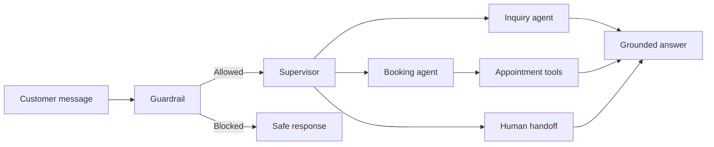

# Multi-Agent Clinic Receptionist

> An AI-powered virtual receptionist that routes customer requests across specialized agents for clinic inquiries, appointment management, safety checks, and human handoff.


## Overview

This project demonstrates a multi-agent customer-support workflow for a dental clinic. A configurable guardrail evaluates each message before a supervisor routes it to the appropriate specialist agent.

The system supports business inquiries, appointment operations, live conversation monitoring, human escalation, and per-agent model configuration through an administrative interface.

## Agent workflow



## Key features

- **Multi-agent routing:** A LangGraph supervisor classifies intent and routes messages to inquiry, booking, or human-handoff agents.
- **Configurable guardrails:** Prompt-injection and out-of-scope checks run before routing and appointment tools.
- **Appointment tools:** Customers can create, view, cancel, and reschedule appointments.
- **Availability protection:** The booking workflow checks past dates, blocked periods, and conflicting doctor appointments.
- **Human escalation:** Conversations can move into a staff handoff state with manual admin replies.
- **Admin dashboard:** Monitor chats, manage bookings and blockouts, update business context, and configure agent models.
- **Multiple LLM providers:** Each agent can use Groq or OpenRouter with its own model configuration.
- **Protected key handling:** Settings endpoints report whether keys exist without returning their values.
- **Guardrail tests:** Automated coverage validates the safety and scope-classification behavior.

## Tech stack

| Area | Technology |
|---|---|
| API | FastAPI |
| Agent orchestration | LangGraph and LangChain |
| LLM providers | Groq and OpenRouter |
| Persistence | SQLAlchemy and SQLite |
| Frontend | HTML, CSS, and JavaScript |
| Testing | pytest |

## Quick start

### 1. Clone the repository

```bash
git clone https://github.com/Asadnaeem23/multi-agent-clinic-bot.git
cd multi-agent-clinic-bot
```

### 2. Create and activate a virtual environment

```bash
python -m venv .venv
```

Windows PowerShell:

```powershell
.\.venv\Scripts\Activate.ps1
```

macOS/Linux:

```bash
source .venv/bin/activate
```

### 3. Install dependencies

```bash
pip install -r requirements.txt
```

### 4. Configure the environment

Copy `.env.example` to `app/backend/.env` and add at least one provider key:

```env
DATABASE_URL=sqlite:///./app.db
GROQ_API_KEY=
OPENROUTER_API_KEY=
CORS_ORIGINS=http://localhost:8001
```

Provider keys can also be entered from the admin settings page during local development.

### 5. Run the application

```bash
cd app/backend
uvicorn server:app --reload --port 8001
```

Open:

- Customer chat: `http://localhost:8001`
- Admin dashboard: `http://localhost:8001/admin.html`
- API documentation: `http://localhost:8001/docs`

## Repository structure

```text
multi-agent-clinic-bot/
|-- app/
|   |-- backend/
|   |   |-- graph.py              # Agents, routing, and appointment tools
|   |   |-- guardrails.py         # Safety and relevance checks
|   |   |-- server.py             # FastAPI endpoints
|   |   |-- database.py           # Persistence layer
|   |   |-- llm_provider.py       # Provider and model selection
|   |   `-- settings_service.py   # Runtime configuration
|   `-- frontend/
|       |-- admin.html             # Monitoring and configuration UI
|       `-- index.html             # Customer chat UI
|-- tests/
|   `-- test_guardrails.py
|-- .env.example
|-- requirements.txt
`-- README.md
```

## Run tests

```bash
pytest
```

## Production note

The current admin interface is intended for local demonstration and does not include admin authentication. Add authentication and authorization to the admin page and management endpoints before exposing the application publicly. Use a production database, secure secret management, HTTPS, and appropriately restricted CORS settings for deployment.

## Portfolio highlights

This project demonstrates:

- Multi-agent workflow design and conditional routing
- Tool-calling with server-controlled ownership context
- Guardrails applied before agent and tool execution
- Stateful chat, booking, and human-handoff workflows
- Configurable LLM infrastructure and operational dashboards
- Backend validation, persistence, API design, and automated testing

